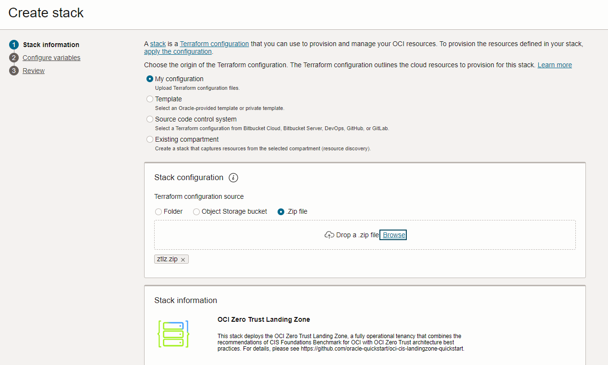
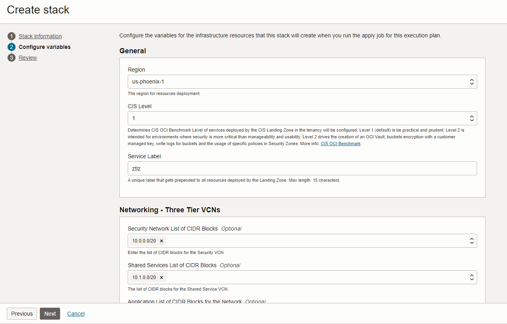
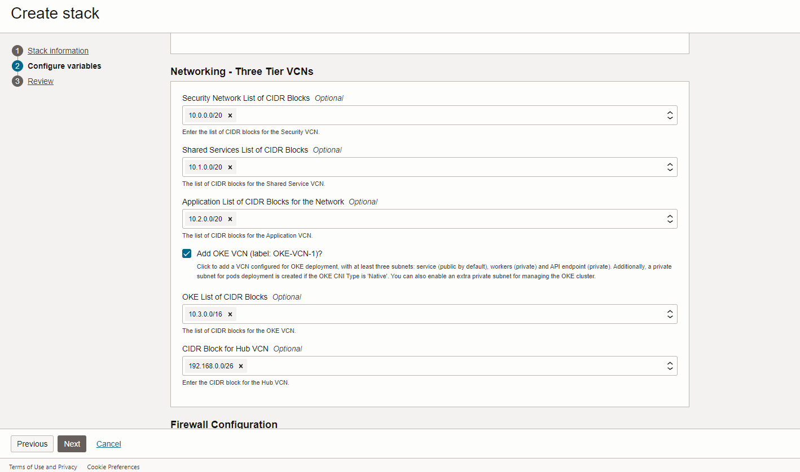
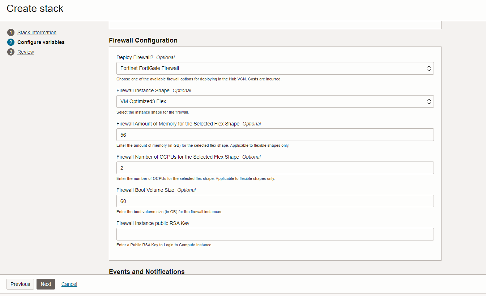
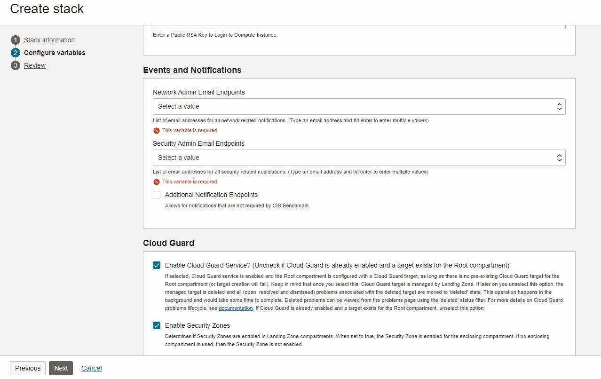
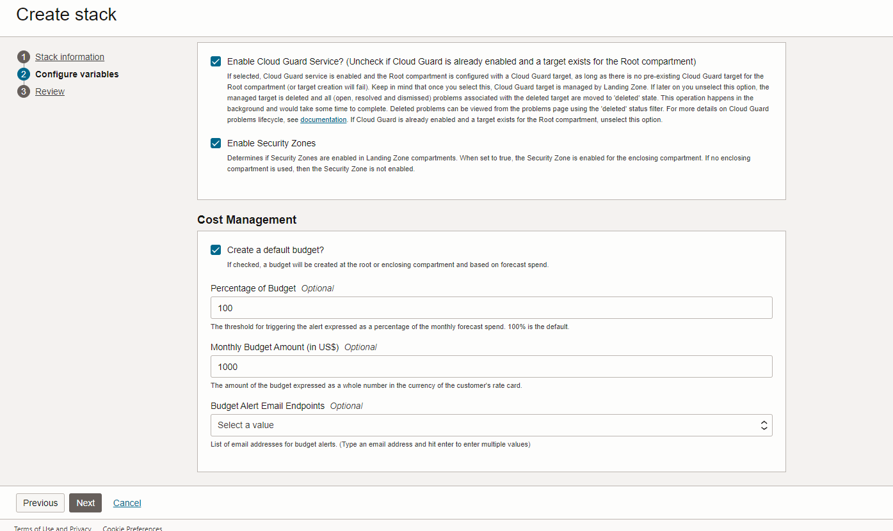

# Table of Contents

1. [Introduction](#introduction)
1. [Considerations](#considerations)
1. [Architecture](#architecture)
1. [Deployment Scenarios](#scenarios)
1. [Ways to Deploy](#ways_to_deploy)
1. [Customizing the Landing Zone](#custom_lz)
1. [Deployment Samples](#samples)

# <a name="introduction"></a>1. Introduction

The Oracle Zero Trust Landing Zone deploys a secure architecture that supports requirements described by NIST, CISA and NCSC.  In addition to the Center for Internet (CIS) Benchmarks support, this Zero Trust Landing Zone will implement a number of additional servicers including Access Governance and a 3rd party firewall.

This reference implementation (referred to as the **Zero Trust Landing Zone** in the rest of this document) is a blend of CIS (Center for Internet Security) Foundations Benchmark for OCI recommendations with OCI architecture best practices around Zero Trust, provided as Terraform code, resulting in an opinionated, configurable, and automated deployment approach for OCI.

The [CIS Oracle Cloud Infrastructure Foundations Benchmark
]( https://www.cisecurity.org/benchmark/oracle_cloud) provides prescriptive guidance when working with OCI as it defines fundamental security principles that do not require any further mapping or refinement. The benchmark recommends: *"Ensure service level admins are created to manage resources of particular service"*, *"Ensure no network security groups allow ingress from 0.0.0.0/0 to port 22"*, *"Ensure Cloud Guard is enabled in the root compartment of the tenancy"*. The benchmark also defines configuration profiles, relating to criticality levels of particular security controls. Version 1.1 of the document defines two configuration profiles: level 1 and level 2. Items in Level 1 intend to be practical and prudent, providing security focused best practice hardening of a technology. Level 2 extends level 1 and is intended for environments where security is more critical than manageability and usability, acting as defense-in-depth measure.

The benchmark document does not include guidance on architectural best practices for OCI, for example: compartment design, network topology, connectivity/routing patterns, lifecycle environments, and how these aspects fit together into a cohesive implementation. The Landing Zone accounts for all these requirements and can be used *as is*, customized or used as a model for other implementations.

The main idea behind the Zero Trust Landing Zone is to allow for the fast enablement of security guard rails where workloads can be subsequently deployed safely. Users are not required to have extensive Terraform knowledge to use the Landing Zone *as is* and should be able to deploy it after entering a few configuration variables.

The Zero Trust Landing Zone does not provision any resources where workloads are directly executed on, like Compute instances, Databases, Containers, or Functions. Instead, it provides the appropriate placeholders and attachment points for such resources. As a mental model, picture the Landing Zone as an airport, where choppers (workloads) can land safely.  Additionally, it provides the network structures like subnets and NSGs (Network Security Groups). On top of that, Landing Zone configures various OCI services for a strong security posture. 


# <a name="considerations"></a>2. Considerations

## 2.1 Access Permissions

The Zero Trust Landing Zone can be run as the tenancy administrator (any user that is a member of the Administrators group) or as a user with narrower permissions.

By default, Zero Trust Landing Zone requires tenancy administrator permissions in the tenancy to deploy because it needs to create policies and compartment at the **root** compartment. Depending on a customer’s specific requirements, it also be created in an enclosing compartment up to 5 levels under the **root** compartment with the groups and dynamic groups residing in the **root** compartment. 

If for some reason the user provisioning the Landing Zone does not have tenancy administrator permissions (which is common in proo- of-concept scenarios), the tenancy administrator should provision the required tenancy level resources first. The Landing Zone has a *pre-config* helper module that tenancy administrators can use for such a purpose. Subsequently, the Landing Zone can be provisioned by a user with narrower permissions. For details, see *Deploying Without Full Permissions* in [Deployment Scenarios](#scenarios) section.


## 2.2 Green Field and Brown Field Deployments

The Landing Zone can be used in new OCI tenancies (Green Field) and existing OCI tenancies (Brown Field). To avoid name clashing, the Landing Zone has a configuration variable called *service_label* that is prefixed to the name for all provisioned resources. 

For a Green Field OCI tenancy deploying becomes a matter of provisioning the Landing Zone and then adding any other resources on top of it. This is the simplest deployment scenario. 

One option for Brown Field OCI tenancy is to deploy the Landing Zone and then existing resources can be manually moved to Landing Zone compartments, which makes them automatically subject to Landing Zone segregation of duties implementation.  Another is to deploy the Landing Zone alongside the existing workload(s) and use the Landing Zone for new workloads.  

## 2.3 Networking

The Zero Trust Landing Zone will deploy different VCNs: 

1. Security VCN that will be used for serving security related resources
1. Shared-Service VCN that will be used for serving the services that can be shared accross multiple workloads and can be used across the entire Landing Zone
1. Application VCN that can host your application workloads
1. Optional OKE VCN that can be used to host your kubernetes based workloads. 

## 2.4 Managing State
When working with Terraform, a key consideration is how to manage state. Terraform works by reconciling differences between the desired state of the infrastructure with the actual state of infrastructure. The desired state is expressed in the configuration files (the *.tf* files), while the actual state is managed by Terraform, typically expressed in *terraform.tfstate* file.

There are a few crucial aspects to consider when managing state:

- **Terraform state must be protected against unintentional changes**: as stated in [https://learn.hashicorp.com/tutorials/terraform/refresh]( https://learn.hashicorp.com/tutorials/terraform/refresh), *"Terraform relies on the contents of your workspace's state file to generate an execution plan to make changes to your resources. To ensure the accuracy of the proposed changes, your state file must be up to date."*. Terraform state is readable text. Unless you have 100% confidence in what you are doing, do not update state manually. Let Terraform manage it or use [Terraform CLI state management commands](https://www.terraform.io/cli/commands/state) if you absolutely need to make a manual change.

    Terraform automatically backs up the state file in *terraform.tfstate.backup* in the same folder as *terraform.tfstate*. Use that in case you cannot recover from a corrupted or lost *terraform.tfstate*.

- **One state tracks one and only one configuration**: when you provision a Landing Zone environment with one set of configuration variables, Terraform manages that infrastructure in one state file. It is normal and expected to change variable values over time. Terraform would simply update your infrastructure accordingly and those changes are reflected in the state file. **Do Not** manage a new Landing Zone environment in a new region using the same configuration by simply changing the region variable and running it. That would destroy the previous environment because there is a single state file. 

- **To manage different environments with the same Terraform configuration:**
    
    You have two options:
    -	Via Terraform CLI, use [Terraform workspaces](https://www.terraform.io/language/state/workspaces). 
    -	Via OCI Resource Manager, create a separate Stack for each Landing Zone environment.


- **Terraform may overwrite changes made via other means to its managed resources**: when you provision infrastructure resources with Terraform, it is expected that those resources are going to be managed via Terraform. However, there are situations where quick changes are made outside Terraform, like via the OCI Console. If you resume using Terraform later, those changes will be detected and Terraform will inform you that those changes will be overwritten. You can either accept that or import those resource changes into the state file. Terraform can import existing resources into the state, but it does not generate configuration. Therefore, before importing existing resources, it is necessary to manually add the imported resources into the configuration files. This approach is recommended for advanced users only and is out of the scope of this document.

> **_NOTE:_** one common pattern is using the Landing Zone template to get a tenancy bootstrapped securely and subsequently use different means to manage the resources. This pattern is prevalent in organizations who are still maturing their Infrastructure as Code practices or in proof-of-concept scenarios.

- **Source-controlling state is risky**: when working in a team environment, it's tempting to source control the state file along with the *.tf* files. Resist this temptation. Terraform state can contain sensitive information and working against the same version of the state file is challenging, as there maybe parallel work occurring at any point in time. The recommended approach is using a remote backend with state locking (which is out-of-box available in OCI Resource Manager).


# <a name="architecture"></a>3. Architecture

The Zero Trust Landing Zone architecture starts with a compartment design for the tenancy along with OCI IAM user groups and OCI IAM policies for segregation of duties. Landing Zone compartments may also be deployed within a designated enclosing (parent) compartment. Each Landing Zone compartment is assigned a group with the appropriate permissions for managing resources in the compartment and for accessing required resources in other compartments.

> **_NOTE:_** using an enclosing compartment reduces the blast radius of the IAM Administrator group to the enclosing compartment.

The Zero Trust Landing Zone will deploy a three-tier VCN: Three subnets are provisioned, one to host the security related resources, one to host the shared services and one for application purposes. Route rules and network security rules are  configured based on provided connectivity settings.  

VCNs will also be connected to an OCI DRG V2 service in a Hub & Spoke topology. The DRG will be used as the central Hub. The DMZ VCN will be configured for firewall deployments. 

The Landing Zone includes multiple pre-configured security services that will be deployed in tandem with the overall architecture for a stronger security posture. These services are *Oracle Cloud Guard*, *Flow Logs*, *Service Connector Hub*
In addition, *Security Zones", *Vault* and *Vulnerability Scanning* will be enabled. 

From a governance perspective, *Notifications* and *Alarms* are setup to use *Topics* and *Events* for alerting administrators about changes and exceeded metric thresholds for deployed resources. The Landing Zone provisions tag defaults to automatically determine resource owner and creation timestamp. Based on user choice, a foundational *Budget* for cost tracking purposes can be created as well.

As an important aspect to governance, logging is also considered by the Landing Zone. Per CIS Oracle Cloud Infrastructure Benchmark, VCN flow logs and Object Storage logging are enabled by default. Landing Zone takes a step forward and, upon user choice, uses Service Connector Hub service to consolidate OCI log sources into a single designated target, which is an Object Storage bucket by default but can also be an OCI Stream or an OCI Function. Such feature makes it easier for making OCI logs available in 3rd-party SIEM solutions, like Splunk.

The diagrams below shows Landing Zone overall architecture: 

**With Simple Networking**


**With Hub & Spoke Networking**


## 3.1 Identity & Access Management (IAM) Configuration

The Landing Zone’s IAM model seeks to enforce segregation of duties and the least privilege principle, by defining compartments, policies, groups and dynamic groups. Existing users can be optionally added to groups, but are not created. The segregation of duties concept is implemented by granting groups *manage* permissions over specific resources on specific compartments. At the same time, other groups are entitled narrower permissions on those same resources. For instance, network administrators are granted *manage* permission over the networking resources in the *Network* compartment. Other groups, like database administrators, are granted *read* permission on *virtual-network-family* in the *Network* compartment and *use* permission on *vnics*, *subnets* and *network-security-groups*, so the databases they provision can make proper use of the network.

### Compartments

At least four compartments are provisioned:

- **Security**: holds security resources that are primarily managed by security administrators. Services and resources include Cloud Guard, Vaults, Keys, Vulnerability Scanning, and Service Connector Hub.

- **Network**: holds network resources that are primarily managed by network administrators. Services include VCN (Virtual Cloud Network) and DRG (Dynamic Routing Gateway).

- **App**: designed to hold services oriented for the application portion of workloads that are primarily managed by application administrators. Services include Compute instances, Storage, Functions, and Kubernetes clusters.

- **Database**: designed to hold database services that are primarily managed by database administrators.

Two extra compartments can be provisioned based on user choice:

- **Exainfra**: designed to hold Exadata infrastructure resources that are primarily managed by Exadata administrators. It is recommended for customers where Exadata infrastructure and databases are managed by different groups.

- **Enclosing compartment**: designed to enclose the aforementioned compartments in a single top compartment. When deploying as a non administrator, an enclosing compartment is mandatory.

### Groups

By default, the Landing Zone defines the following personas that account for most organization needs:

- **IAM Administrators**: manage IAM services and resources including compartments, groups, dynamic groups, policies, identity providers, authentication policies, network sources, tag defaults. However, this group is not allowed to manage the out-of-box *Administrators* and *Credential Administrators* groups. It's also not allowed to touch the out-of-box *Tenancy Admin Policy* policy.
- **Credential Administrators**: manage users capabilities and users credentials in general, including API keys, authentication tokens and secret keys.
- **Cost Administrators**: manage budgets and usage reports.
- **Auditors**: entitled with read-only access across the tenancy and the ability to use cloud-shell to run the *cis_reports.py* script. 
- **Announcement Readers**: for reading announcements displayed in OCI Console.
- **Security Administrators**: manage security services and resources including Vaults, Keys, Logging, Vulnerability Scanning, Web Application Firewall, Bastion, Service Connector Hub.
- **Network Administrators**: manage OCI network family, including VCNs, Load Balancers, DRGs, VNICs, IP addresses.
- **Application Administrators**: manage application related resources including Compute images, OCI Functions, Kubernetes clusters, Streams, Object Storage, Block Storage, File Storage.
- **Database Administrators**: manage database services, including Oracle VMDB (Virtual Machine), BMDB (Bare Metal), ADB (Autonomous databases), Exadata databases, MySQL, NoSQL, etc. 
- **ExaCS Administrators** (only created when ExaCS compartment is created): manage Exadata infrastructure and VM clusters in the ExaCS compartment.
- **Storage Administrators**: the only group allowed to delete storage resources, including buckets, volumes and files. Used as a protection measure against inadvertent deletion of storage resources.

> **_NOTE:_** following least privilege principle, groups are only entitled to manage, use, read or inspect the necessary resources to fulfill their duties.

### Dynamic Groups

The Landing Zone defines four dynamic groups to satisfy common needs of workloads that are eventually deployed:

- **Security Functions**: to be used by functions defined in the Security compartment. The matching rule includes all functions in the Security compartment. An example is a function for rotating secrets kept in a Vault.
- **AppDev Functions**: to be used by functions defined in the AppDev compartment. The matching rule includes all functions in the AppDev compartment. An example is a function for processing of application data and writing it to an Object Storage bucket.
- **Compute Agent**: to be used by Compute's management agent in the AppDev compartment.
- **Database KMS**: to be used by databases in the Database compartment to access keys in the Vault service.

### Policies

The Landing Zone policies implement segregation of duties and follow least privilege across the different personas (groups). Segregation of duties is implemented by granting specific permissions to a single target group on a single target compartment. For example, only *Network Administrators* can manage the network family, and this is done only in the *Network* compartment. Only *Database Administrators* can manage databases, and this is done only in the *Database* compartment. Least privilege is followed when deploying a database, *Database Administrators* are entitled to use the network managed by *Network Administrators* in the *Network* compartment. Some policies are common to all groups, like the ability to use Cloud Shell in tenancy and to manage Resource Manager stacks in their specific compartments. The policy list is extensive, comprehensive, and human-readable. We recommend reviewing *config/iam_policies.tf* for additional details.  

Policies are attached at different compartments depending on the presence of an enclosing compartment. If Landing Zone compartments are deployed directly under the Root compartment (thus no enclosing compartment), all policies are attached to the Root compartment. If Landing Zone compartments are deployed within an enclosing compartment, some policies are attached to the Root compartment, while some are attached to the enclosing compartment itself. This is to allow for free movement of Landing Zone compartments without the need to change policy statements. The policies at Root compartment are applied to resources at the tenancy level.

In OCI, services also need to be explicitly granted. The Landing Zone provisions policies authorizing Cloud Guard, Vulnerability Scanning Service and OS Management Service the necessary actions for their functioning. We recommend reviewing *config/iam_service_policies.tf* for additional details.


## 3.2 Network Configuration

The Zero Trust Landing Zone will deploy a three-tier VCN: Three subnets are provisioned, one to host the security related resources, one to host the shared services and one for application purposes. Route rules and network security rules are  configured based on provided connectivity settings.  

VCNs will also be connected to an OCI DRG V2 service in a Hub & Spoke topology. The DRG will be used as the central Hub. The DMZ VCN will be configured for firewall deployments. 

Inbound access to the SSH port from 0.0.0.0/0 IP range is strictly prohibited.

Due to very nature of Terraform, it is possible to add, modify and delete VCNs.

A firewall can also be deployed through the Landing Zone, however it is important to understand that the current deployment of the Zero Trust Landing Zone will not configure the firewall. Depending on the type of firewall, that still requires manual configuration. 

## 3.3 Governance

The strong governance framework established by Landing Zone IAM foundation is complemented by monitoring, cost tracking and resources tagging capabilities.

### Monitoring

CIS OCI Foundations Benchmark strongly focuses on monitoring. It's very important to start with a strong monitoring foundation and make appropriate personel aware of changes in the infrastructure. The Landing Zone implements the Benchmark recommendations through a notifications framework that sends notifications to email endpoints upon infrastructure changes. This framework is 100% enabled by OCI Events and Notifications services. When an event happens (like an update to a policy), a message is sent to a topic and topic subscribers receive a notification. In Landing Zone, subscribers are email endpoints, that must be provided for IAM and network events, as mandated by CIS Benchmark. IAM events are always monitored in the home region and at the Root compartment level. Network events are regional and monitored at the Root compartment level.

Landing Zone extends events monitoring with operational metrics and alarms provided by OCI Monitoring service. Landing Zone queries specific metrics and sends alarms to a topic if the query condition is satisfied. Topic subscribers receive a notification. This model allows for capturing resource level occurrences like excessive CPU/memory/storage consumption, FastConnect channel down/up events,  Exadata infrastructure events, and others.    

As mandated by CIS Benchmark, Landing Zone also enables VCN flow logs to all provisioned subnets and Object Storage logging for write operations.

Last, but not least, Landing Zone uses OCI Service Connector Hub to consolidate logs from different sources, including VCN flow logs and Audit logs. This is extremely helpful when making OCI logs available to 3rd-party SIEM (Security Information and Event Management) or SOAR (Security Orchestration and Response) solutions. OCI Service Connector Hub can aggregate OCI logs in Object Storage, send them to an OCI Stream or to an OCI Function. By default, the Landing Zone uses Object Storage as the destination. 

### Cost Tracking

The resources deployed through the Zero Trust Landing Zone are free of charge, except from the cost of the compute instance that hosts the firewall as well as the license for the firewall (which is not included in the Zero Trust deployment). If you want to evaluate the architecture and components of the Zero Trust Landing Zone, you can choose not to deploy a firewall, which will also not create a compute instance.  This makes the Zero Trust Landing Zone free of charge. If there's a possibility of cost, Landing Zone does not enable the resource by default, leaving it as an option. This is the case of Service Connector Hub, for instance, as customers may incur in costs if large amounts of logs are sent to an Object Storage bucket. For this reason, Service Connector Hub has to be explicitly enabled by Landing Zone users.

After setting the basic foundation with Landing Zone, customers deploy their workloads, by creating cost consuming resources, like Compute instances, databases, storage. For avoiding surprises with costs, Landing Zone allows for the creation of a basic budget that notifies a provided email address if a forecasted spending reaches a specific threshold. If an enclosing compartment is deployed, the budget is created at that level, otherwise it is created at the Root compartment.

### Resources Tagging

Resources tagging is an important component of a governance framework, as it allows for the establishment of a fine-grained resource identification mechanism, regardless of the resource compartment. In OCI, this enables two critical aspects: cost tracking and tag-based policies.

Landing Zone implements three facets of resources tagging:

- **Tag Defaults**: Landing Zone provisions *CreatedBy* (who) and *CreatedOn* (when) tag defaults in a brand new tag namespace if the *Oracle-Tags* namespace is not available in the tenancy. Tag defaults allow for automatic tagging on any subsequently deployed resources. This is mandated by CIS Foundations Benchmark and it is extremely useful for identifying who created a particular resource and when.
- **Landing Zone tag**: Landing Zone uses a freeform tag to tag all provisioned resources with the simple objective of identifying them as Landing Zone resources.
- **Customer-defined tags**: Customers can also tag Landing Zone resources as they wish, either via defined tags or freeform tags. Defined tags imply the creation of a tag namespace, while freeform tags do not. This is the approach that customers take when aiming for tag-based policies and cost tracking. As Landing Zone cannot predict namespaces and tag names, custom tags are considered a customization. Check [Customizing Landing Zone](#custom_lz) section for a complete example.

# <a name="scenarios"></a>4. Deployment Scenarios

In this section we describe the main deployment scenarios for the Landing Zone and how to implement them. 

## 4.1 Identity & Access Management

### Using an Enclosing Compartment

By default, the Landing Zone compartments are deployed in the tenancy root compartment. In such case, all Landing Zone policies are attached to the root compartment. This behavior is changed by the following configuration variables:

- **use_enclosing_compartment**: a boolean flag indicating whether or not to provision the Landing Zone within an enclosing compartment other than the root compartment. When provisioning the Landing Zone as a narrower-permissioned user, it must be set to true.

- **existing_enclosing_compartment_ocid**: The OCID of a pre-existing enclosing compartment where Landing Zone compartments are to be created. If *use_enclosing_compartment* is false, the module creates the Landing Zone compartments in the root compartment as long as the executing user has the required permissions. If *use_enclosing_compartment* is true, but *existing_enclosing_compartment_ocid* is not set, a default enclosing compartment is created under the root compartment with the name *<service_label>-top-cmp*.

If an enclosing compartment is deployed, Landing Zone policies that are not required to be attached at root compartment are attached to the enclosing compartment. This allows the enclosing compartment to be later moved anywhere in the compartments hierarchy without any policy changes.


## 4.2 Networking

### Hub & Spoke Topology

Landing Zone VCNs can be deployed in a Hub & Spoke topology. Multiple spokes can be connected via a single peering connection to a central Hub VCN. This deployment type is particularly prevalent in organizations that require packet inspection firewall appliances to monitor incoming external traffic (North/South) and/or traffic across the spoke VCNs (East/West). The peering is implemented via DRG (Dynamic Routing Gateway) v2, that can peer VCNs in same or different regions. The DRG can either be provisioned by Landing Zone or an existing DRG can be taken. This is important to customers that have already set connectivitity to their on-premises network. The Hub VCN is also referred as the DMZ VCN, as it is typically the entry point to the spoke VCNs for requests originating from untrusted perimeters, like the Internet. Note, however, that a DMZ VCN is not required in this topology, as the DRG itself can act as the Hub. The Hub & Spoke topology is governed by these input variables:

- **hub_spoke_architecture**: when set to true, the spokes VCNs are peered via a DRG, that is either provisioned or reused.
- **existing_drg_id**: the OCID of an existing DRG. If provided, the existing DRG is used to peer the spoke VCNs. Otherwise, a brand new DRG is provisioned. If no **dmz_vcn_cidr** is provided, the DRG itself acts as the hub.
- **dmz_vcn_cidr**: if provided, a DMZ (Hub) VCN is provisioned with the given CIDR range and all traffic is routed through this VCN.
- **dmz_for_firewall**: determines is the DMZ VCN will be used for deploying 3rd-party firewalls, in which case DRG attachments are not created.
- **dmz_number_of_subnets**: major firewall appliances have different requirements regarding the number of subnets to deploy. Check the vendor's documentation or OCI reference architecture to determine the number of subnets required.
- **dmz_subnet_size**: the number of bits with which to extend the DMZ VCN CIDR prefix. For instance, if **dmz_vcn_cidr**'s prefix is 20 (/20) and **dmz_subnet_size** is 4, subnets are going to be /24.

### Deploying a DMZ VCN for Firewall Appliances

When deploying the Landing Zone with the intent of deploying network firewalls later, DRG attachments are not created for any of the VCNs (Virtual Cloud Network) because this is done by the security partner. Their configuration will create the DRG attachments for the VCNs and route the traffic through the firewall appliance, creating a choke point. The only routing the Landing Zone will do is the spoke VCN routing. This choke point will be used to monitor traffic in and out of OCI as well as between VCN spokes. Each partner requires a different number of subnets in the DMZ VCN. Use the below chart to determine how many subnets you will need in your DMZ VCN:

Security Partner   | Number of Subnets 
-------------------|-------------------
Check Point        |         2         
Cisco              |         5         
Fortinet           |         4         
Palo Alto Networks |         4         

Besides the variables described in the previous section, adding a firewall appliance requires an extra variable:

- **dmz_for_firewall**: determines if the DMZ VCN will be used for deploying 3rd party firewalls. When set to true, DRG attachments are not created.


### Blocking Internet Access

By default, Landing Zone's Three-Tier Web Application VCN deploys out a public subnet (the "web" subnet) with routes to the VCN Internet Gateway. That may not be desirable sometimes, as customers may want a fully private setup, where they can deploy private load balancers accessible only to other VCNs on from their data centers. There is a single input variable controlling this behavior:

- **no_internet_access**: when set to true, it makes all "web" subnets private and does not attach an Internet Gateway to any of the Three-Tier VCNs. Note the variable does not apply to ExaCS VCNs, as the subnets in that case are already private. 

## 4.3 Governance
### Operational Monitoring
#### Alerting
The Landing Zone deploys a notification framework to alert administrators about infrastructure changes. By default, only IAM and networking events are enabled, as mandated by CIS Foundations Benchmark. Events for other resources can be enabled by Landing Zone users. OCI Events service monitors OCI resources for changes and posts a notification to a topic. Topic subscribers are then notified about such changes. This framework is deployed in each compartment including the Root compartment where IAM events are configured. Examples of such events are updates to a policy or the creation of a new VCN.

Landing Zone also gives insights into the health of infrastructure resources used by cloud applications through metrics and alarms in OCI Monitoring service. Classic examples are raising an alarm to Compute administrators if an instance's CPU/memory comsumption goes over 80% and raising an alarm to network administrators if FastConnect or VPN is down. Check blog post [How to Operationalize the CIS Landing Zone with Alarms and Events](https://www.ateam-oracle.com/post/operational-monitoring-and-alerting-in-the-cis-landing-zone) for a list of metric conditions and events that can raise an alarm in Landing Zone.

Landing Zone exposes this functionality through variables with a list of email addresses to notify:

- **security_admin_email_endpoints**: required, a list of email addresses to receive notifications for security (including IAM) related events. IAM events and topic are always created in the home region at the Root compartment.
- **network_admin_email_endpoints**: required, a list of email addresses to receive notifications for network related events. Network events and topic are regional and created at the Root compartment.
- **storage_admin_email_endpoints**: optional, a list of email addresses for all storage related notifications. If no email addresses are provided, then the topic, events and alarms associated with storage are not created.
- **compute_admin_email_endpoints**: optional, a list of email addresses for all compute related notifications. If no email addresses are provided, then the topic, events and alarms associated with compute are not created.
- **budget_admin_email_endpoints**: optional, a list of email addresses for all budget related notifications. If no email addresses are provided, then the topic, events and alarms associated with governance are not created.
- **database_admin_email_endpoints**: optional, a list of email addresses for all database related notifications. If no email addresses are provided, then the topic, events and alarms associated with database are not created.
- **exainfra_admin_email_endpoints**: optional, a list of email addresses for all Exadata infrastructure related notifications. If no email addresses are provided, then the topic, and alarms associated with Exadata infrastructure are not created. If a compartment for Exadata is not created, then Exadata events are created in the database compartment and sent to the database topic.

With the exception of notifications for security and network, the other categories also depend on the user explitly asking for enabling events and alarms:

- **create_events_as_enabled**: when set to true, events rules are created and enabled. If left as false, events rules are created but will not emit notifications.
- **create_alarms_as_enabled**: when set to true, alarms are created and enabled. If left as false, alarms are created but will not emit notifications.

An extra variable allows Landing Zone users to determine how OCI should format the alarms messages:

- **alarm_message_format**: default is *PRETTY_JSON* (after all everybody seeks beauty in things). Other possible values are *ONS_OPTIMIZED* (optimized for Oracle Notification Service) and *RAW*.

> **_NOTE:_** Monitoring IAM and network events are a CIS Foundations Benchmark Level 1 requirement.

#### Logging
Logging is another Landing Zone operational monitoring facet. As mandated by CIS Foundations Benchmark, Landing Zone automatically enables VCN flow logs for all provisioned subnets. Flow logs are useful for detecting packet flow issues across the network. Landing Zone also enables Object Storage logging for write operations.

Another important log source is OCI Audit log as it records all requests to OCI services control plane APIs. The Audit log is automatically enabled by OCI.

Landing Zone channels VCN flow logs and Audit logs through Service Connector Hub (SCH) to Object Storage (by default), thus providing a consolidated view of logging data and making them more easily consumable by customers' SIEM and SOAR systems. Optionally, SCH's target can be an OCI Streaming topic or an OCI Function. Preserving Landing Zone always free tenet, SCH must be explicitly enabled as costs can be triggered on Object Storage consumption. 

Check blog post [Security Log Consolidation in CIS OCI Landing Zone](https://www.ateam-oracle.com/post/security-log-consolidation-in-cis-oci-landing-zone) for details on Landing Zone SCH configuration.

> **_NOTE:_** VCN flow logs and Object Storage write logs are CIS Foundation Benchmark Level 2 requirements. Service Connector Hub is not mandated.

### Cost Tracking (Tagging and Budgets)

Landing Zone deploys a pair of tag defaults if the *Oracle-Tags* namespace is not already present in the tenancy. This pair is made of *CreatedBy* and *CreatedOn* tags. *CreatedBy* is configured for cost tracking and identifies the Terraform executing user. *CreatedOn* is the resource creation timestamp. There is no input variable controlling this behavior.

> **_NOTE:_** *CreatedBy* and *CreatedOn* tags are a CIS Foundations Benchmark Level 1 requirement, but not from a cost tracking perspective.

Landing Zone also allows for the definition of custom tags, that can be created as cost tracking tags. Custom tags is implemented as a customization and a complete example is provided in [Customizing the Landing Zone](#custom_lz) section.

A foundational budget can be deployed to alert customers on their OCI spending. The input variables controlling this behavior are:

- **create_budget**: if checked, a budget is created at the Root or enclosing compartment and based on forecast spending.
- **budget_alert_threshold**: the threshold for triggering the alert expressed as a percentage of the monthly forecast spending.
- **budget_amount**: the amount of the budget expressed as a whole number in the customer rate card's currency.
- **budget_alert_email_endpoints**: list of email addresses for budget alerts.

> **_NOTE:_** Budgeting is not mandated by CIS Foundations Benchmark.

### Oracle Access Governance

#### Overview
Landing Zone may optionally deploy the OCI IAM policies for deploying an [Oracle Access Governance]() instance.  To do this select **Enable Oracle Access Governance groups and policies** in your Oracle Resource Manager stack deployment in OCI or set `enable_oag_prerequisite_policies` to `true`.  When enabled the Landing Zone will provide a new or existing group with the policies required for the Oracle Access Governance instance's service account and add policies to the Security Administrator to be able to create and Oracle Access Governance (OAG) instance in the security compartment.

#### Policies

The policies granted to the Access Governance Group which are used for the OAG Instance to query OCI services in the tenancy are read only.  This allows for OAG to review access in the OCI tenancy and align to the CIS OCI Foundations Benchmark.  The policy statements are below:

```
allow group <label>-access-gorvernance-group to inspect all-resources in tenancy
allow group <label>-access-gorvernance-group to read policies in tenancy
allow group <label>-access-gorvernance-group to read domains in tenancy
```

The Security Admin group is granted following additional policies to deploy an Oracle Access Governance instance in the Security compartment: 

```
allow group <label>-security-admin-group to manage agcs-instance in compartment <label>-security-cmp
```

#### Deploying OAG an instance 
As a user in the <labal>-security-admin-group follow the steps in [Set Up Service Instance](https://docs.oracle.com/en/cloud/paas/access-governance/cagsi/).

#### Enabling an OAG an instance to review OCI IAM access in the tenancy
After the OAG instance is provisioned follow steps from the [Integrate with Oracle Cloud Infrastructure (OCI) Identity and Access Management (IAM) ](https://docs.oracle.com/en/cloud/paas/access-governance/tjrtj/index.html#GUID-29D81CB5-08BB-45CB-8911-416F6FFDB0C9) to configure the OAG Instance to review the OCI IAM policies .  

1. As a user in the <label>-iam-admin-group or the Administrator group go to the **Set up Identity Resources Manually** section and preform the below steps:
    1. Follow the these steps and the links provided to set up identity resources in your cloud tenancy.
        1. [Create an identity user](https://docs.oracle.com/en-us/iaas/Content/Identity/Tasks/managingusers.htm#three), agcs_user, in the Default domain for Oracle Access Governance access.
        1. [Provision the user](https://docs.oracle.com/en-us/iaas/Content/Identity/access/managing-user-credentials.htm) with the following capabilities:
            - API keys: Select the check box for API authentication.
        1. [Assign the identity user](https://docs.oracle.com/en-us/iaas/Content/Identity/Tasks/managinggroups.htm#three) (agcs_user) to the identity group (<label>-access_governance-group) 
1. As a user in the <label>-cred-admin-group or the Administrator group go to the **Generate API Keys and Oracle Cloud Identifier (OCID) to configure your Cloud Environment in the Oracle Access Governance Console** section and complete all steps in this section.

1. As a user in the <label>-security-admin-group go to the **Establish Connection by Adding a New Connected System - OCI IAM** and complete all steps in this section.

## 4.4 Security Services

Landing Zone enables the following OCI security services for a strong security posture. 

### Cloud Guard

Cloud Guard is a key component in OCI secure posture management. It uses detector recipes to monitor a target (compartment hierarchies) for potentially risky configurations and activities. It then emits findings known as problems. These problems can be rectified with responders. Landing Zone enables Cloud Guard only if it's not enabled. When enabling, a target is provisioned for the Root compartment with the out-of-box *Configuration* and *Activity* detector recipes and *Responder* recipe. Once enabled by Landing Zone, it can be later disabled using the following variable:

- **cloud_guard_configuration_status**: determines whether Cloud Guard should be enabled in the tenancy. If set to 'ENABLE', a Cloud Guard target is created for the Root compartment, but only if Cloud Guard is not already enabled.

> **_NOTE:_** Enabling Cloud Guard is a CIS Foundations Benchmark Level 1 requirement.

### Vaults

Some customers want more control over the lifecycle of encryption keys. By default, Landing Zone provisions a *Vault* with a *Key* that is used to encrypt a sample Object Storage bucket. While this key could be used by other clients, we recommend creating different keys for security and lifecycle reasons. Currently, Landing Zone does not expose any variables to control the provisioning of vaults and keys.

**Note**: Encrypting with customer-managed keys is a CIS Foundations Benchmark Level 2 requirement.

### Vulnerability Scanning

At a high level, OCI Vulnerability Scanning service (VSS) works by defining recipes and targets. A recipe sets the scanning parameters for a resource, including what to scan and how often. A target represents the resource to scan with a recipe, such as compute instances. A nice shortcut is defining a compartment as a target. In which case, all compute instances further deployed in that compartment are automatically made scanning targets.

As VSS is free, it is enabled by default in Landing Zone, that creates a default recipe and one target for each deployed compartment. The default recipe is set to execute weekly on Sundays, which can be easily changed when provisioning the Landing Zone.

With such target settings, any hosts deployed in the Landing Zone compartments are guaranteed to be scanned. All targets are created in the *Security* compartment, which means the vulnerabilities reports are also created in the *Security* compartment. The Landing Zone grants Security admins the right to manage these reports while allowing other admins the ability to read them. 

The input variables for VSS are:

- **vss_create**: whether Vulnerability Scanning Service recipes and targets are to be created in the Landing Zone. Default is true.
- **vss_scan_schedule**: the scan schedule for the Vulnerability Scanning Service recipe, if enabled. Valid values are WEEKLY or DAILY. Default is WEEKLY.
- **vss_scan_day**: the weekday for the Vulnerability Scanning Service recipe, if enabled. It only applies if vss_scan_schedule is WEEKLY. Default is SUNDAY.

For more details on VSS in Landing Zone, check blog post [Vulnerability Scanning in CIS OCI Landing Zone](https://www.ateam-oracle.com/post/vulnerability-scanning-in-cis-oci-landing-zone).

> **_NOTE:_** VSS is not mandated by CIS Foundations Benchmark.


# <a name="ways_to_deploy"></a>5. Ways to Deploy

Zero Trust Landing Zone can be deployed on OCI in a few ways. This section describes and examines them, providing guidance when to use each one.

## 5.1 Deploying with Terraform CLI

Within the root module folder, provide variable values in the existing *vars.tfvars* file.

Next, execute:

	> terraform init
	> terraform plan -var-file="vars.tfvars" -out plan.out
	> terraform apply plan.out

Alternatively, after providing the variable values in *vars.tfvars*, rename it to *terraform.tfvars* and execute:	

	> terraform init
	> terraform plan -out plan.out
	> terraform apply plan.out

### The Executing Identity

Terraform CLI executes under the identity passed to Terraform provider. In Landing Zone, the identity is defined in *vars.tfvars* (or *terraform.tfvars*) file. 

    tenancy_ocid         = "<tenancy_ocid>"
    user_ocid            = "<user_ocid>"
    fingerprint          = "<user_api_key_fingerprint>"
    private_key_path     = "<path_to_user_private_key_file>"
    private_key_password = ""

The *fingerprint* and private key pair are obtained in OCI Console when an API key is created for the user. Save the private key file locally and provide its path (absolute or relative) to the *private_key_path* variable.

### When to Use This Method

By default, Terraform CLI manages state locally and does not provide state locking. Therefore, make sure no more than one user can execute the configuration at one point in time. Use this method for development or testing only. For production, state locking is crucial. As such, provide some means to guarantee the integrity of Terraform state file, either by integrating remote state locking in your Terraform configuration or via strict access controls.

### Managing Multiple Landing Zones with the Same Config Files

Sometimes you may want to manage multiple Landing Zones in same or different regions without managing multiple copies of the Terraform configuration files. All you need to do is making sure the state files do not get overwriten across subsequent runs. When working with Terraform CLI, use Terraform workspaces along with distinct .tfvars file, one to each Landing Zone. Terraform workspaces keep Terraform state files separate from each other. You only need to make sure to switch between workspaces and the respective .tfvars file.

For instance, let's say you want to provision a production Landing Zone in Ashburn and a development Landing Zone in Phoenix. To deal with this, create two workspaces, say prd-ash and dev-phx. Also prepare two .tfvars file with proper variables assignments, terraform_ash.tfvars and terraform_phx.tfvars. Then you can execute plan and apply safely. Here's how it looks like using Terraform CLI commands:

    > terraform workspace new prd-ash (creates workspace and switches to it)
    > terraform workspace new dev-phx (creates workspace and switches to it)
    
    > terraform workspace select prd-ash (switches to workspace)
    > terraform plan -var-file=./terraform_ash.tfvars -out plan.out (runs a plan using state file kept in prd-ash workspace)
    > terraform apply plan.out

    > terraform workspace select dev-phx (switches to workspace)
    > terraform plan -var-file=./terraform_phx.tfvars -out plan.out (runs a plan using state file kept in dev-phx workspace)
    > terraform apply plan.out

## 5.2 Deploying with OCI Resource Manager UI

There are a few different ways to run Terraform code using OCI Resource Manager Service (RMS) user interface. Here we describe two of them: 
- creating an RMS stack by uploading a zip file to RMS;
- creating an RMS stack by integrating with GitLab. 

A stack is the RMS term for a Terraform configuration and provide an isolated scope for Terraform state. A Stack manages one and only Terraform configuration. Therefore, for managing multiple Landing Zone configurations, use multiple stacks, one for each configuration.

Regardless of the chosen method (zip file or GitLab) **an RMS Stack must not contain any state file or *.terraform* folder in Terraform working folder.

For more RMS information, please see https://docs.cloud.oracle.com/en-us/iaas/Content/ResourceManager/Concepts/resourcemanager.htm.

### The Executing Identity

RMS UI executes under the identity of the connected user in OCI Console.

### When to Use This Method

RMS manages state and supports locking, so there is no risk of more than one user executing the stack. This method is safe to be used in any environment and is recommended for users who prefer a UI-based deployment approach or are not familiar with Terraform CLI or RMS APIs.

### Stack from Zip File
Download this repository as a .zip file, by expanding the Code button in the repository home page and choosing the "Download ZIP" option.

Using OCI Console, navigate to Resource Manager service page and create a stack based on a .zip file. In the **Create Stack** page:
1. Select **My Configuration** option as the origin of the Terraform configuration.
2. In the **Stack Configuration** area, select the **.Zip file** option and upload the .zip file downloaded in the previous step.



Alternatively, you can simply click the button below to supply the zip file directly from GitHub without downloading it:

[](https://cloud.oracle.com/resourcemanager/stacks/create?zipUrl=https://github.com/oracle-quickstart/oci-cis-landingzone-quickstart/archive/refs/heads/main.zip)

*If you are logged in your OCI tenancy, the button will take you directly to OCI Resource Manager where you can proceed to deploy. If you are not logged, the button takes you to Oracle Cloud initial page where you must enter your tenancy name and log in to OCI.*

3. In **Working Directory**, make sure the root folder is selected.
4. In **Name**, give the stack a name or accept the default.
5. In **Create in Compartment** dropdown, select the compartment to store the Stack.
6. In **Terraform Version** dropdown, **make sure to select 0.15.x at least. Lower Terraform versions are not supported**.


Following the Stack creation wizard, the subsequent step prompts for variables values. Please see the [Config Module Input Variables](VARIABLES.md#config_input_variables) for the variables description. 

Following variables are provided from the RMS UI and should be reviewed and tweaked accordingly: 

**General**

- **Region**: Region where to deploy the Zero Trust Landing Zone into
- **CIS Level**: The CIS level that you want the Landing Zone to adhere to. Keep in mind that setting this value to 2 will result in deployment of a vault which might incurr cost! 
- **Service Label**: A unique label that will be used as a prefix in front of all created resources



**Networking**

- **Security Network CIDR Block**: The CIDR block used for the security VCN
- **Shared Services CIDR Block**: The CIDR block used for the shared services VCN
- **Application CIDR Block**: The CIDR block used for the application VCN
- **Add OKE VCN**: Enabling this option will add an OKE VCN so you can start deploying OKE related workloads 
- **OKE CIDR Block**: The CIDR block for the OKE VCN
- **Hub & Spoke CIDR block**: The CIDR block used for the Hub & Spoke VCN



**Firewall**

- **Deploy Firewall?**: Select the type of firewall you want to deploy
- **Firewall instance Shape**: The shape of the compute instance where the firewall will be deployed
- **Firwall Amount of Memory**: Amount of RAM memory to allocate to the compute instance.
- **Firewall Number of OCPUs**: The amount of OCPUs used for the compute instance
- **Firewall boot volume size**: the size of the boot volume used for the firewall
- **Firewall instance public RSA Key**: The public RSA key from your private key that would allow you to SSH into the compute instance for the firewall




**Events and Notifications**

- **Network Admin Email Endpoints**: A list of email addresses that will receive Network Admin alerts.
- **Security Admin Email Endpoints**: A list of email addresses that will receive Security Admin alerts.




**Cloud Guard**

- **Enable Cloud Guard Service**: Enable this checkbox if cloud guard hasn't been enabled in your tenancy. If it's already enabled, this checkbox needs to be disabled. 
- **Enable Security Zones**: Determines if Security Zones are enabled in Landing Zone compartments. When set to true, the Security Zone is enabled for the enclosing compartment. If no enclosing compartment is used, then the Security Zone is not enabled.


**Cost Management**

- **Create Default Budget**: If checked, it will create default budgets for the deployed Landing Zone so you can track cost
- **Percentage of Budgets**: The threshold for triggering the alert expressed as a percentage of the monthly forecast spend.
- **Monthly Budget Amount**: The amount in US$ of the budget expresses as a whole number
- **Budget Alert Email Endpoints**: A list of email addresses that will receive the budget alerts.




Once variable values are provided, click Next, review stack values and create the stack. 

In the Stack page use the appropriate buttons to plan/apply/destroy your stack.